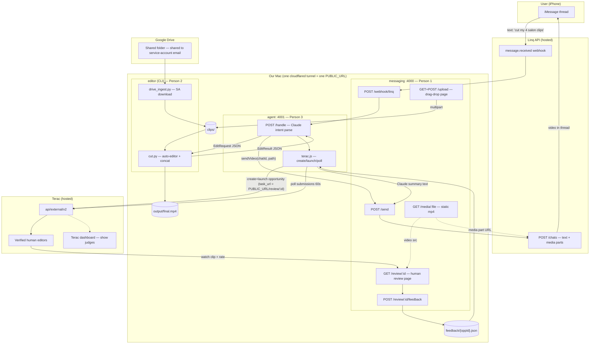

# jptr — Architecture

Single source of truth for the system design. Per-person build guides: [messaging/IMPLEMENTATION.md](messaging/IMPLEMENTATION.md) · [editor/IMPLEMENTATION.md](editor/IMPLEMENTATION.md) · [agent/IMPLEMENTATION.md](agent/IMPLEMENTATION.md)

## System Diagram



## Components

| Component | Owner | Port | Tech | State |
|---|---|---|---|---|
| messaging | Person 1 | 4000 | Node/Express + `@linqapp/sdk` + cloudflared | to build |
| agent | Person 3 | 4001 | Node/Express + Anthropic SDK + terac.js | to build |
| editor | Person 2 | CLI | Python: auto-editor, gdown, google-api-python-client | `cut.py` DONE (smoke-tested 12s→7.1s); `drive_ingest.py` to build |

## Endpoint Map (canonical — do not drift)

### messaging :4000
| Route | Purpose |
|---|---|
| `POST /webhook/linq` | Linq `message.received` inbound (HMAC-verified, raw body) → forwards `{chatId, text, from}` to agent `POST :4001/handle` |
| `POST /send` | `{chatId, videoPath?, text?, caption?}` → Linq `POST /chats` (video sent as media part pointing at `PUBLIC_URL/media/final.mp4`) |
| `GET /upload` | Drag-drop upload page (plain HTML) |
| `POST /upload` | Multipart clips → `clips/` (accept .mp4/.mov/.m4v, 500MB cap) |
| `GET /review/:id` | Terac reviewer page: `<video>` + 1–5 stars + comments |
| `POST /review/:id/feedback` | Persist ReviewFeedback → `feedback/{oppId}.json` |
| `GET /media/:file` | Static serve `output/` (Linq media part + review page video src) |

### agent :4001
| Route | Purpose |
|---|---|
| `POST /handle` | `{chatId, text, from}` → Claude intent parse → EditRequest → spawn `python3 editor/cut.py` → on EditResult → `POST :4000/send` |
| `POST /terac/launch` | `{videoPath, chatId}` → create+launch Terac opportunity, start poll loop |
| `GET /terac/status/:oppId` | Debug/judge view of poll state + collected feedback |

## Data Contracts

Frozen (see [CONTRACT.md](CONTRACT.md)): `EditRequest`, `EditResult`, messaging send surface.

**Backward-compatible optional additions** (documented here, CONTRACT.md untouched):

```json
// EditRequest — optional ingest fields (at most one used)
{ "driveFolderId": "1AbC...", "driveUrl": "https://drive.google.com/drive/folders/..." }
// driveFolderId → service-account download (drive_ingest.py)
// driveUrl      → gdown link-share fallback (already implemented)
// neither       → clips/ already populated (drag-drop upload path)
```

```json
// ReviewFeedback (review page → feedback store)
{ "oppId": "opp_123", "participantId": "p_456", "rating": 4, "comments": "tighten the intro", "submittedAt": "2026-07-24T20:00:00Z" }
```

```json
// TeracSummary (agent → messaging /send as text)
{ "oppId": "opp_123", "avgRating": 4.3, "n": 3, "quotes": ["tighten the intro", "great pacing"] }
```

## Auth Flows — Step 0: Link Your Accounts

All secrets in `.env` (gitignored). `.env.example`:

```bash
# messaging
LINQ_API_KEY=            # Linq dashboard / rep
LINQ_FROM_NUMBER=        # provisioned +1 number
PUBLIC_URL=              # cloudflared tunnel URL, set after tunnel up

# agent
ANTHROPIC_API_KEY=
TERAC_API_KEY=           # Terac dashboard → org settings → API keys

# editor
GOOGLE_APPLICATION_CREDENTIALS=./editor/sa-key.json   # gitignored
DRIVE_FOLDER_ID=         # from folder URL
```

### Google Drive (service account — the "connect your Drive" flow)
1. console.cloud.google.com → new project `jptr` → enable **Google Drive API**.
2. IAM → Service Accounts → create `jptr-editor` → Keys → add JSON key → save as `editor/sa-key.json` (**gitignored — never commit**).
3. **User connects their Drive by sharing**: in Drive, share the clips folder with the service-account email (`jptr-editor@<project>.iam.gserviceaccount.com`) as Viewer. That share IS the account link — no OAuth consent screen needed.
4. Agent announces the SA email in the iMessage session-start message so the user knows what to share to.
5. Fallback (zero setup): folder shared "anyone with link" → gdown path (already works).

### Linq
Bearer key already in hand. Webhook subscription created once at messaging boot (`POST /webhook-subscriptions`, events `message.received`, target `PUBLIC_URL/webhook/linq`). Verify HMAC via SDK `webhooks.unwrap` with RAW request body.

### Terac
API key from dashboard org settings. Bearer auth. **Poll-only** — no webhooks exist; agent polls. Rate limit 100 req/min (60s poll interval is fine).

## Terac Human-in-the-Loop — Design

**Why**: real human editors judge our auto-cut → differentiation + sponsor prize. Terac recruits/screens the humans; the actual video review happens on OUR hosted page (`task_url`).

**Screener criteria (locked)**:
- Filters: `[{ "multi_select--job_function": { "$in": ["<editor/creator-adjacent values>"] } }]` — enumerate real option values first via `GET /filters/multi_select--job_function/options` (booth-confirm exact values, e.g. media/design roles).
- Screening question: `{ "key": "edits_video", "text": "Do you edit or post short-form video at least weekly?", "pick": "one", "answers": [ {"text":"Yes","qualify_logic":"must"}, {"text":"No","qualify_logic":"reject"} ] }`
- `num_participants: 3` (demo) — cheap, fast, enough for an average.
- Task: `{ "sequence": 1, "task_type": "survey", "review_type": "auto_approve", "task_url": "<PUBLIC_URL>/review/<oppId>", "duration_minutes": 4 }`

**Feedback loop (endpoints already in map)**:
1. Edit done → agent `POST /terac/launch` → create project (once) → create opportunity → launch.
2. Humans click `task_url` → watch clip (`/media/final.mp4`) → rate + comment → `POST /review/:id/feedback`.
3. Agent polls Terac `GET /opportunities/{id}/submissions` every 60s AND reads `feedback/{oppId}.json`.
4. Exit when `n >= 3` or 45-min timer → Claude summarizes → messaging `POST /send`: *"3 pro editors reviewed your cut — 4.3/5. 'Tighten the intro.' 'Great pacing.'"* → lands in same iMessage thread.
5. Judges: show Terac dashboard opportunity page live + the iMessage summary arriving.

**Timing reality**: human responses arrive in hours, not minutes. Demo plan: launch a real opportunity 1–2h before judging; keep one pre-collected run as backup; the poll loop + dashboard are the live proof.

**Booth-confirm list**: exact `task_type`/`review_type` enums, completion-code handshake for custom task_url pages, available `job_function` option values, how the $250 credit is applied.

## Failure Modes

| Failure | Fallback |
|---|---|
| Linq video media part rejected | Send text + `PUBLIC_URL/media/final.mp4` link; worst case imsg-plus local send |
| Drive SA setup stalls | gdown link-share path (working today) or drag-drop `/upload` |
| Terac responses too slow for demo | Pre-collected run + live dashboard + poll log on screen |
| Claude parse fails | Hardcoded default: cut non-talking, all clips, margin 0.2s |
| Premiere MCP flaky | It's garnish — skip, show `output/timeline.xml` import manually |
