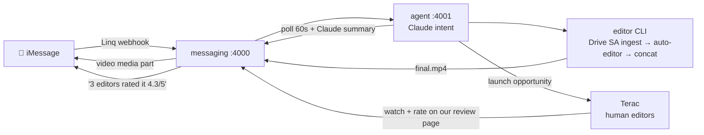

# jptr — iMessage → Video Editing Agent

**Hackathon build. 4 hours. 3 people. Zero merge conflicts by design.**

Text an iMessage ("hey, I have 4 clips from yesterday at a salon, cut all the non-talking clips") → agent pulls the clips from your Google Drive → auto-cuts the non-talking parts → texts the edited video back in the same thread → real human editors review it via Terac and their feedback lands in the thread too.

**Docs:** [ARCHITECTURE.md](ARCHITECTURE.md) (diagram + endpoint map + auth flows) · [messaging/IMPLEMENTATION.md](messaging/IMPLEMENTATION.md) · [editor/IMPLEMENTATION.md](editor/IMPLEMENTATION.md) · [agent/IMPLEMENTATION.md](agent/IMPLEMENTATION.md)

## Flow



**Step 0 — link your accounts (before anything):**
1. **Google Drive**: create service account, enable Drive API, save `editor/sa-key.json` (gitignored). User "connects" by sharing their clips folder to the SA email — no OAuth screens. Fallbacks: link-share + gdown, or drag-drop upload.
2. **Linq**: bearer key + provisioned number (in hand). Webhook subscription at boot.
3. **Terac**: API key from dashboard org settings. $250 hackathon credit.
Full detail: [ARCHITECTURE.md → Auth Flows](ARCHITECTURE.md#auth-flows--step-0-link-your-accounts).

**Step 0.5 — no Drive? drag & drop:** agent texts you `PUBLIC_URL/upload` on session start — drop clips in browser, they land in `clips/`.

## Validated Stack (researched, not vibes)

| Layer | Tool | Why |
|---|---|---|
| iMessage I/O | **Linq API v3** ([docs.linqapp.com](https://docs.linqapp.com/)) | `POST /chats` sends text + media parts (video reply); webhook subscription for `message.received`. Node SDK `@linqapp/sdk`. Tunnel via cloudflared. |
| Clip ingest | **Google Drive service account** (`google-api-python-client`) | User shares folder to SA email = the account link. gdown link-share + drag-drop upload as fallbacks. |
| Cut engine | **auto-editor** (`pip install auto-editor`) | One command removes non-talking parts. ffmpeg concat for multi-clip. `--export premiere` for timeline garnish. **Built + smoke-tested: 12s → 7.1s.** |
| Human-in-the-loop | **Terac** ([docs.terac.com](https://docs.terac.com/)) | Recruits verified human editors (job_function filters + screening question). They review the cut on OUR hosted page (`task_url`), feedback polls back → Claude summary → iMessage. Poll-only, no webhooks. $250 sponsor credit. |
| Premiere garnish | **[premiere-pro-mcp](https://github.com/leancoderkavy/premiere-pro-mcp)** | Opens real Premiere timeline for wow shot. NOT critical path — only if core loop done by T-90min. |
| Brain | Claude API (Haiku for intent, Sonnet for summaries) | Parses "cut non-talking" → pipeline params. Hardcoded fallback if parse fails. |

**Fallback if Linq stalls:** [imsg-plus](https://github.com/micahbrich/imsg-plus) — local Mac Messages.app CLI. `watch --json` receive, `send --file video.mp4` reply. ~15min, needs Full Disk Access.

## Repo Layout — no-merge design

```
jptr/
├── README.md
├── ARCHITECTURE.md       ← diagram, endpoint map, contracts, auth (canonical)
├── CONTRACT.md           ← frozen after kickoff; optional additions live in ARCHITECTURE.md
├── messaging/            ← Person 1 ONLY  (IMPLEMENTATION.md inside)
├── editor/               ← Person 2 ONLY  (IMPLEMENTATION.md inside)
├── agent/                ← Person 3 ONLY  (IMPLEMENTATION.md inside)
├── clips/                (gitignored footage)
├── output/               (gitignored renders)
└── feedback/             (gitignored Terac review feedback)
```

**Rule: each person commits/pushes ONLY their folder. Disjoint folders = no conflicts. `git pull --rebase && git push`.**

## Person Split

| Person | Owns | Spec | Headline tasks |
|---|---|---|---|
| **1** | `messaging/` :4000 | [messaging/IMPLEMENTATION.md](messaging/IMPLEMENTATION.md) | Linq webhook + send video, cloudflared tunnel, **drag-drop upload page**, **Terac review page**, media serving. ⚠ Test video media part in FIRST 30 MIN. |
| **2** | `editor/` CLI | [editor/IMPLEMENTATION.md](editor/IMPLEMENTATION.md) | ✅ cut.py done. Remaining: **Drive service-account ingest** (`drive_ingest.py`), test on real salon footage. |
| **3** | `agent/` :4001 | [agent/IMPLEMENTATION.md](agent/IMPLEMENTATION.md) | Claude intent parse, orchestration, **Terac client** (screeners, launch, 60s poll, summary → iMessage), demo script, Premiere garnish. |

## Timeline gates

- **T+30min:** Linq round-trip proven (webhook fires, sample video sends).
- **T+90min:** full loop — text in → `final.mp4` back in iMessage thread.
- **T-120min:** launch real Terac opportunity (responses take hours — start early).
- **T-45min:** freeze features, rehearse demo x2 with fresh clips.

## Risks (ranked)

1. **Linq video media-part send** — untested. Mitigate first 30min. Fallback: send link / imsg-plus.
2. **Terac turnaround** — hours not minutes. Launch early + pre-collected backup run + live dashboard.
3. Webhook tunnel + HMAC — SDK unwrap + raw-body middleware.
4. auto-editor threshold on noisy salon audio — `AUDIO_THRESHOLD=0.04` knob documented.
5. Premiere MCP flakiness — garnish only.
